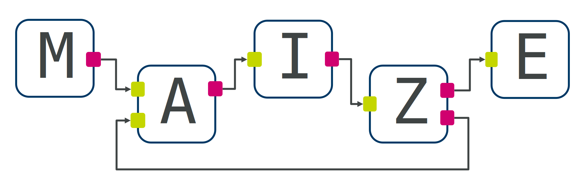

*maize* is a graph-based workflow manager for computational chemistry pipelines.

It is based on the principles of [*flow-based programming*](https://github.com/flowbased/flowbased.org/wiki) and thus allows arbitrary graph topologies, including cycles, to be executed. Each task in the workflow (referred to as *nodes*) is run as a separate process and interacts with other nodes in the graph by communicating through unidirectional *channels*, connected to *ports* on each node. Every node can have an arbitrary number of input or output ports, and can read from them at any time, any number of times. This allows complex task dependencies and cycles to be modelled effectively.

This repository contains the core workflow execution functionality. For domain-specific steps and utilities, you should additionally install [**maize-contrib**](https://github.com/MolecularAI/maize-contrib), which will have additional dependencies.

Teaser
------
A taste for defining and running workflows with *maize*.

```python
"""A simple hello-world-ish example graph."""

from maize.core.interface import Parameter, Output, MultiInput
from maize.core.node import Node
from maize.core.workflow import Workflow

# Define the nodes
class Example(Node):
    data: Parameter[str] = Parameter(default="Hello")
    out: Output[str] = Output()

    def run(self) -> None:
        self.out.send(self.data.value)


class ConcatAndPrint(Node):
    inp: MultiInput[str] = MultiInput()

    def run(self) -> None:
        result = " ".join(inp.receive() for inp in self.inp)
        self.logger.info("Received: '%s'", result)


# Build the graph
flow = Workflow(name="hello")
ex1 = flow.add(Example, name="ex1")
ex2 = flow.add(Example, name="ex2", parameters=dict(data="maize"))
concat = flow.add(ConcatAndPrint)
flow.connect(ex1.out, concat.inp)
flow.connect(ex2.out, concat.inp)

# Check and run!
flow.check()
flow.execute()
```

Installation
------------
If you plan on not modifying maize, and will be using [maize-contrib](https://github.com/MolecularAI/maize-contrib), then you should just follow the installation instructions for the latter. Maize will be installed automatically as a dependency.

Note that [maize-contrib](https://github.com/MolecularAI/maize-contrib) requires several additional domain-specific packages, and you should use its own environment file instead if you plan on using these extensions.

To get started quickly with running maize, you can install from an environment file:

```bash
conda env create -f env-users.yml
conda activate maize
pip install --no-deps ./
```

If you want to develop the code or run the tests, use the development environment and install the package in editable mode:

```bash
conda env create -f env-dev.yml
conda activate maize-dev
pip install --no-deps ./
```

### Manual install
Maize requires the following packages and also depends on python 3.10:

- dill
- networkx
- pyyaml
- toml
- numpy
- matplotlib
- graphviz
- beartype
- psij-python

We also strongly recommend the installation of [mypy](https://mypy.readthedocs.io/en/stable/). To install everything use the following command:

```bash
conda install -c conda-forge python=3.10 dill networkx yaml toml mypy
```

If you wish to develop or add additional modules, the following additional packages will be required:

- pytest
- sphinx

Docs
----
You can find guides, examples, and the API in the [**documentation**](https://molecularai.github.io/maize).

Status
------
*maize* is still in an experimental stage, but the core of it is working:
- Arbitrary workflows with conditionals and loops
- Subgraphs, Subsubgraphs, ...
- Type-safe channels, graph will not build if port types mismatch
- Nodes for broadcasting, merging, round-robin, ...
- Potential deadlock warnings
- Multiple retries
- Fail-okay nodes
- Channels can send most types of data (using dill in the background)
- Commandline exposure
- Custom per-node python environments
