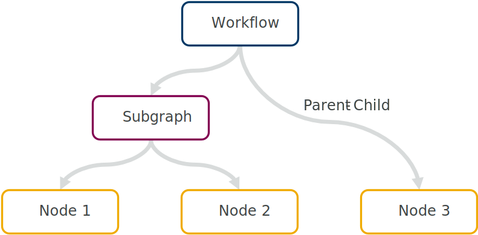
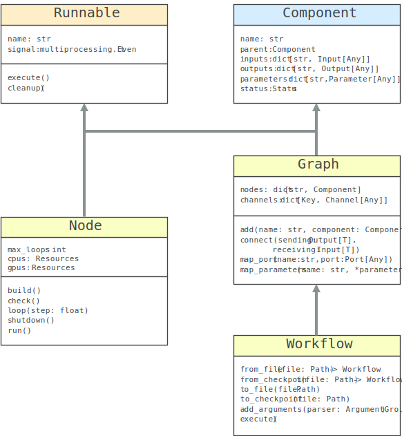
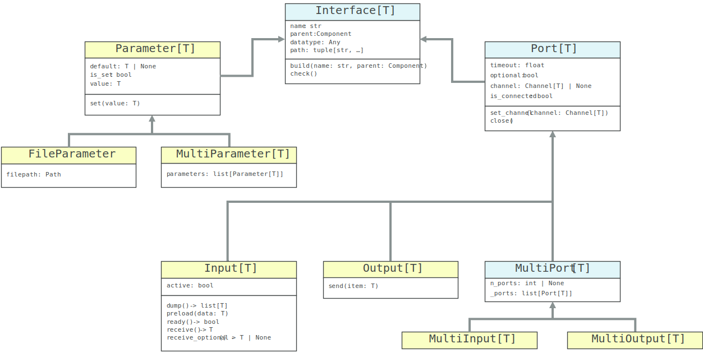

Design
======
This document describes the design of the core underlying *maize*, intended for anyone wishing to make modifications or just get an overview of the code. While we will briefly cover some user-facing aspects, most details on the exact use can be found in the :doc:`user guide <userguide>`.

At its core, *maize* is an implementation of the flow-based programming paradigm. A workflow is modelled as a graph, with individual nodes performing certain tasks. Nodes are connected among each other through channels, and this is indeed the only communication between components. Contrary to directed-acyclic-graph execution, each node runs *simultaneously* in its own process, and performs computation as soon as one or more inputs are received.

Nodes and Graphs
----------------
Nodes (:mod:`maize.core.node`) are defined by creating a class inheriting from :class:`~maize.core.node.Node`. It requires parameters as well as at least one input or output port to be declared in the class body. It also requires a :meth:`~maize.core.node.Node.run` method with the actual code to be run as part of the graph. The user can receive or send data at any time from any of the ports and make use of the parameters.

Subgraphs (:mod:`maize.core.graph`) allow logical groupings of individual nodes and are defined by inheriting from :class:`~maize.core.graph.Graph` and defining a :meth:`~maize.core.graph.Graph.build` method. This method defines the graph structure by adding nodes and connecting their ports using the :meth:`~maize.core.graph.Graph.add` and :meth:`~maize.core.graph.Graph.connect` methods respectively. The :meth:`~maize.core.graph.Graph.map_parameters` and :meth:`~maize.core.graph.Graph.map_port` methods allow one to reference ports and parameters from contained nodes and expose them externally, thus making the subgraph appear like a separate node. In fact, both :class:`~maize.core.node.Node` and :class:`~maize.core.graph.Graph` inherit most functionality from :class:`~maize.core.component.Component`, representing a general node in a graph.

Workflows
---------
Workflows (:mod:`maize.core.workflow`) are defined by instantiating a new :class:`~maize.core.workflow.Workflow` object and adding nodes or subgraphs using the :meth:`~maize.core.graph.Graph.add` method, as one would for a subgraph. These are connected using :meth:`~maize.core.graph.Graph.connect`, and parameters can be declared for commandline use using :meth:`~maize.core.graph.Graph.map_parameters`. The workflow may not have any unconnected ports though. This and other basic properties can be checked using :meth:`~maize.core.graph.Graph.check`. Workflows have the same functionality as graphs, but with some additional methods to allow for instantiating from a file or saving state. They also expose the :meth:`~maize.core.workflow.Workflow.execute` method for actually running the workflow.

While the computational layout of a *maize* workflow is obviously a graph, it is also a tree:

The workflow object sits at the root, with subgraphs representing branches, and individual nodes as leaves. Every class in this hierarchy inherits from :class:`~maize.core.component.Component`, encapsulating behaviour for referring to parents and children in the tree structure, as well as addressing them. Many properties of a node are by default inherited from the parent object:

Interfaces
----------
Interfaces (:mod:`maize.core.interface`) describe how nodes, graphs, and workflows interact with each other and the outside world. There are two main types of interfaces - :class:`~maize.core.interface.Parameter` and :class:`~maize.core.interface.Port`. The former describes any values passed to a component at compile time, before actually running the workflow. These will typically be initial inputs, configuration files, or program running options. The latter describes how a component communicates with others, specifically in the form of inputs (:class:`~maize.core.interface.Input`) and outputs (:class:`~maize.core.interface.Output`). Every interface inherits from :class:`~maize.core.interface.Interface` and contains a name and reference to it's owning component.

Because interfaces are declared as class attributes to avoid excess boilerplate, they use a special :meth:`~maize.core.interface.Interface.build` method to create a new separate instance when building the parent component. A further unique property of all interfaces is that they are type-safe, i.e. each interface has a specific datatype (using the python :mod:`typing` module). Type consistency can be checked by static type-checkers such as `mypy <https://mypy.readthedocs.io/en/stable/>`_, but the type information is also saved in a :attr:`~maize.core.interface.Interface.datatype` attribute so it can be used at compile- or run-time to verify if connections are compatible or parameters conform to the correct type.

Running
-------

Workflow
^^^^^^^^
*maize* can be divided into two separate systems - the code that is run as part of the main process (while constructing the graph), and code that is run in a separate child process, typically the individual nodes. The former includes the class bodies and :meth:`~maize.core.graph.Graph.build` methods, while the latter will always be the :meth:`~maize.core.node.Node.run` method. Upon calling :meth:`~maize.core.workflow.Workflow.execute` on a workflow, *maize* will start each :meth:`~maize.core.node.Node.run` method in a separate python process and receive messages from each node. These messages include status updates (:class:`~maize.core.runtime.StatusUpdate`) and possible errors. The workflow can stop in the following ways:

1. *maize* collects enough status updates indicating stopped or completed nodes to complete the graph.
2. One of the nodes sets the workflow-wide shutdown signal (:attr:`~maize.core.workflow.Workflow.signal`)
3. *maize* catches an error raised by a node (as long as the node is not configured to ignore it)

Upon shutdown, *maize* will attempt to join all processes with a timeout. In addition to the nodes, a separate :class:`~maize.core.runtime.Logger` process is also started, and shutdown last.

Node
^^^^
While the :meth:`~maize.core.node.Node.run` method is user defined, it is not called directly by the workflow. Instead, it is wrapped by a general :meth:`~maize.core.node.Node.execute` method responsible for cleanly executing the user code. It (and the private :meth:`~maize.core.node.Node._attempt_loop`) is responsible for attempting to run any code multiple times if so requested, handling certain logging aspects, and sending errors on to the main process.

A key aspect of the individual node execution procedure is how ports are handled. Because channels have a limited capacity, and may be full or empty when trying to send or receive items, they need to be polled in such a way as to avoid unresponsive or frozen processes. This is generally accomplished by attempting to :meth:`~maize.core.interface.Output.send` or :meth:`~maize.core.interface.Input.receive` with a timeout continuously in a loop and monitoring the parent shutdown signal and connected channel. If, for example, an upstream node has finished processing, the receiving input port will attempt to receive a final item and then shutdown the port. This can cause an intentional shutdown cascade, mimicking the behaviour expected from a directed acyclic graph.

Nodes can be classified into two groups: ones performing only a single calculation, and ones running continuously. The latter should use the :meth:`~maize.core.node.Node.loop` generator to allow a clean shutdown, and make use of the :meth:`~maize.core.interface.Input.ready` method to check if data can be received from a port. This is to ensure that optional inputs can be skipped, for example when merging data from different sources (see :class:`~maize.core.steps.Merge` for an example).

.. caution::
   Using continuous nodes with cyclic topologies can easily result in deadlock-prone workflows. Make sure you have a clean exit strategy for each node using :meth:`~maize.core.node.Node.loop`.
