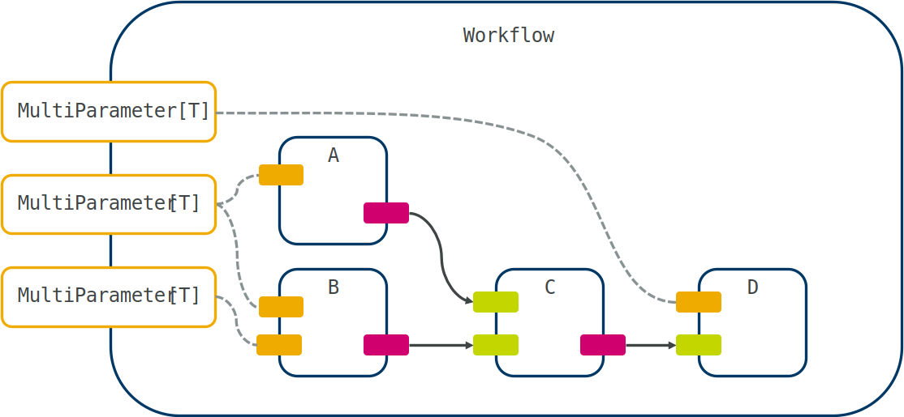
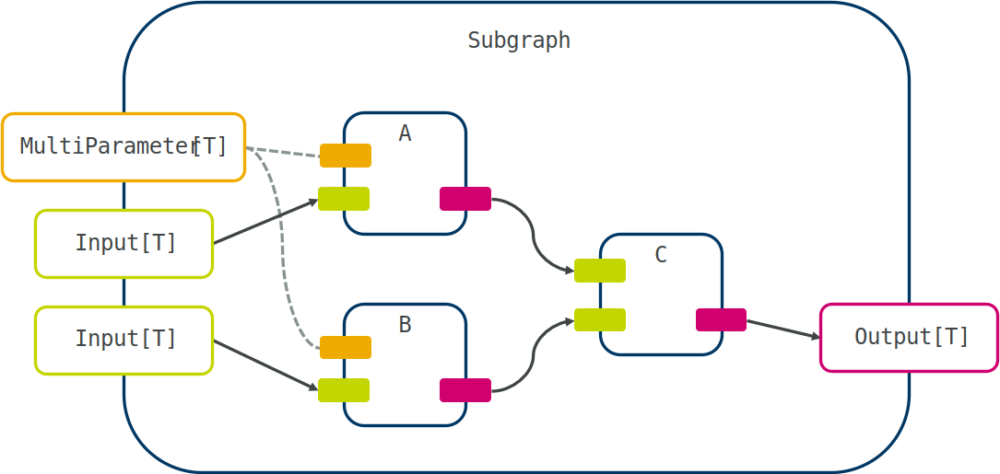
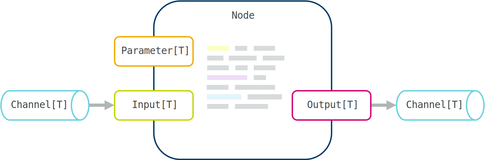

User guide
==========

This is a detailed user guide for *maize*. We will approach workflows in a top-down manner, starting with workflow definitions, followed by grouping multiple nodes together in subgraphs, and finally discussing how to implement custom functionality in your own nodes.

Workflows
---------
A :term:`workflow` is a high-level description of a :term:`graph`, allowing execution. It contains multiple :term:`nodes <node>` or :term:`subgraphs <subgraph>`, joined together with :term:`channels <channel>`. You can construct a workflow from both pre-defined nodes and custom ones to tailor a workflow to your particular needs. The following image summarizes the anatomy of a workflow with exposed parameters, with :term:`parameters <parameter>` shown in yellow, :term:`inputs <input>` in green, and :term:`outputs <output>` in red:

Workflows can be defined programmatically in python (the most flexible approach), or described in a tree-based serialization format (``JSON``, ``YAML``, or ``TOML``). They can then be run within python, or exposed as a commandline tool to be integrated into other pipelines. In contrast to pipelining tools like `*airflow* <https://airflow.apache.org/>`_ and `*luigi* <https://github.com/spotify/luigi>`_, *maize* can run workflows with arbitrary topologies including cycles and conditionals.

.. _custom-workflows:

Adding nodes
^^^^^^^^^^^^
Defining a workflow starts by creating a :class:`~maize.core.workflow.Workflow` object:

.. code-block:: python
   
   from maize.core.workflow import Workflow

   flow = Workflow(name="Example")

Not specifying a name will result in a random 6-character sequence being used instead. There are additional useful options:

.. code-block:: python
   
   flow = Workflow(
      name="Example",
      level="debug",
      cleanup_temp=False, 
      default_channel_size=5, 
      logfile=Path("out.log")
   )

`level` specifies the logging verbosity (see the :mod:`python logging module <logging>`), `cleanup_temp` specifies whether the directories created during execution should be cleaned up, `default_channel_size` determines how many items can sit in an inter-node channel at a time, and `logfile` allows one to write the logs to a file, as opposed to ``STDOUT``.

We can then start adding nodes to the workflow using the :meth:`~maize.core.workflow.Workflow.add` method:

.. code-block:: python
   
   node = flow.add(Example)

Note that if you want to add another ``Example`` node, you will have to specify a custom name:

.. code-block:: python
   
   node2 = flow.add(Example, name="other_example")

We can again specify additional options that change the way the node is set up and how it is run, including :term:`parameters <parameter>` to be overridden:

.. code-block:: python
   
   other = flow.add(
      OtherExample,
      name="other",
      parameters=dict(value=42),
      loop=True,
      fail_ok=True,
      n_attempts=3,
      max_loops=5
   )

If not explicitly told to do so, the :meth:`~maize.core.node.Node.run` method of the node, containing all user code, will only run once. That means it will typically wait to receive some data, process it, send it onwards, and then shutdown. If you want to keep it running and continuously accept input, you can set ``loop`` to ``True``. If you want to limit the maximum number of iterations, use ``max_loops``, by default the node will loop until it receives a shutdown signal or detects neighbouring nodes shutting down.

.. tip::
   The ``max_loops`` argument can be useful when testing the behaviour of continuously running nodes. For some examples, see the test suites for :mod:`~maize.steps.plumbing`.

Any failures encountered during execution will raise an exception and cause the whole workflow to shutdown (the default), unless ``fail_ok`` is enabled. This can be useful for additional optional calculations that are not upstream of other essential nodes. Similarly, if a node is expected to fail occasionally, one can increase ``n_attempts`` from the default ``1``.

The order nodes are added doesn't matter. Alternatively, if you want to add a lot of nodes at once, you can use the :meth:`~maize.core.workflow.Workflow.add_all` method and specify multiple node classes:

.. code-block:: python
   
   node, other = flow.add_all(Example, OtherExample)

You won't be able to directly override any parameters or specify additional keyword arguments though.

.. tip::
   When defining a new node, it will be automatically added to an internal registry of node types. The node class (not instance) can then be retrieved from the name only using the :meth:`~maize.core.component.Component.get_node_class` function.

Setting parameters
^^^^^^^^^^^^^^^^^^
Configuration of nodes is performed using :term:`parameters <parameter>`. These are typically node settings that are unique to that node and the wrapped software, and would make little sense to change during execution of a workflow. These are things like configuration files or other set-and-forget options. Parameters can be set at node instantiation with :meth:`~maize.core.workflow.Workflow.add` as mentioned above, or on the nodes themselves using the :meth:`~maize.core.interface.Parameter.set` method:

.. code-block:: python
   
   node.value.set(37)
   other.config.set(Path("config.yml"))

You can also set them on the commandline, if they are correctly exposed (see `running workflows <#running-workflows>`_).

Alternatively, :term:`inputs <input>` can also act as :term:`parameters <parameter>`. This simplifies cases in which values might normally be set statically at workflow definition, but should allow changes in some special workflow cases. To enable this, :class:`~maize.core.interface.Input` can be instantiated with the ``optional`` flag and / or default values (using ``default`` and ``default_factory``). In those cases, it will not have to be connected to another port and can be used as a parameter instead. Note that once the port is connected, it will not be able to be used as a parameter.

Handling external software
^^^^^^^^^^^^^^^^^^^^^^^^^^
In many cases, nodes will depend on packages that may have conflicts with other packages from other nodes. In this situation it is possible to run a node in a different python environment by specifying the path to the desired python executable (e.g. as part of a ``conda`` environment) to the special, always available :attr:`~maize.core.node.Node.python` parameter. In this case you must make sure that the relevant imports are defined in :meth:`~maize.core.node.Node.run` and not in the top-level. In addition, the other environment must also have maize installed.

If your system has a *module* framework, and the node you're using requires custom software, you can use the :attr:`~maize.core.node.Node.modules` parameter to list modules to load.

.. danger::
   Module loading is performed in the python process of the node, not in a subprocess. Thus, any modifications to the existing python environment can have unintended consequences.

If a node requires custom scripts you can use the :attr:`~maize.core.node.Node.scripts` parameter to specify an ``interpreter`` - ``script`` pair, or if you installed the required command in a non-standard location (and it's not in your ``PATH``), you can use the :attr:`~maize.core.node.Node.commands` parameter.

.. tip::
   All these options (:attr:`~maize.core.node.Node.python`, :attr:`~maize.core.node.Node.modules`, :attr:`~maize.core.node.Node.scripts`, :attr:`~maize.core.node.Node.commands`) can be specified in a workflow-agnostic configuration file (see `global config <#configuring-workflows>`_). This is useful for one-time configurations of HPC or other systems.

Connecting nodes
^^^^^^^^^^^^^^^^
The next step is connecting the individual nodes together. In most cases, you should prefer the :meth:`~maize.core.graph.Graph.connect` method:

.. code-block:: python

   flow.connect(node.output, other.input)

Maize will assign a :term:`channel` connecting these ports together based on their types. If the type is a file or a list or dictionary of files (using :class:`pathlib.Path`), Maize will use a special :class:`~maize.core.channels.FileChannel` to connect the ports, with the option of either copying the file(s) (the default, and appropriate for smaller files), creating a symlink (when dealing with potentially large files) with ``mode="link"``, or simply moving the file(s) using ``mode="move"``.

In some cases you might be faced with creating a long sequential workflow in which you are joining many nodes with a single :term:`input` and single :term:`output` each. In that case you can use the more convenient :meth:`~maize.core.graph.Graph.auto_connect` or :meth:`~maize.core.graph.Graph.chain` methods on the nodes instead of the ports:

.. code-block:: python

   flow.auto_connect(node, other)

   # Or:
   flow.chain(node, other, another, and_another)

In general it is better to explicitly define the connection though, as these methods will attempt to connect the first compatible pair of ports found. If you are faced with creating a lot of connections at once, you can use the :meth:`~maize.core.graph.Graph.connect_all` method with (:term:`output` - :term:`input`) pairs:

.. code-block:: python

   flow.connect_all(
      (node.output, other.input),
      (other.output, another.input)
   )

.. caution::
   Static type checking for :meth:`~maize.core.graph.Graph.connect_all` and :meth:`~maize.core.graph.Graph.add_all` is only implemented for up to 6 items due to limitations in Python's type system.

Some nodes, especially general purpose data-piping tools such as those provided under :doc:`steps <steps/index>`, use special ports that allow multiple connections (:class:`~maize.core.interface.MultiPort`). In this case, just call :meth:`~maize.core.graph.Graph.connect` multiple times on the same port. This will create more ports and connections as required:

.. code-block:: python

   flow.connect_all(
      (node.output, other.input),
      (node.output, another.input)
   )

Here we have connected the output of ``node`` to two different node inputs. Note that this is *only* possible with :class:`~maize.core.interface.MultiPort`, this is because there is some ambiguity on whether data packets should be copied or distributed (if you want to implement behaviour like this, look at the :mod:`~maize.steps.plumbing` module). Under the hood, :class:`~maize.core.interface.MultiPort` creates multiple individual ports as required, and the node using them must loop through them to send or receive items.

Handling parameters
^^^^^^^^^^^^^^^^^^^
One step we might want to perform is to expose node-specific parameters on the workflow level. This can be done using :meth:`~maize.core.graph.Graph.map`, it will simply map all node parameters to the workflow, using the same name:

.. code-block:: python

   flow.map(other.value, another.param, and_another.temperature)

The workflow will now have parameters named ``value``, ``param``, and ``temperature``. These will be accessible as attributes on the workflow itself, or in the :attr:`~maize.core.component.Component.parameters` dictionary. For more fine-grained control over naming, and mapping multiple node parameters to a single workflow parameter, use :meth:`~maize.core.graph.Graph.combine_parameters`:

.. code-block:: python

   flow.val = flow.combine_parameters(other.value, another.value, name="val")

Here both passed parameters are mapped to a single one, allowing a single call to :meth:`~maize.core.interface.Parameter.set` to adjust multiple values at once. One example where this can be useful is a temperature setting for many physical computations. Thus, a call to :meth:`~maize.core.interface.Parameter.set` will set both ``other.value`` and ``another.value`` to ``37``:

.. code-block:: python

   flow.val.set(37)

.. _alt-workflow:

Alternative workflow definitions
^^^^^^^^^^^^^^^^^^^^^^^^^^^^^^^^
While a workflow definition through python is the most flexible, it can also be done using a suitable serialization format. In this example we will use ``YAML`` due to its readibility, but you can also use ``JSON`` or ``TOML``:

.. code-block:: yaml

   name: workflow
   nodes:
   - name: node
     type: Example
     parameters:
       value: 42
   - name: term
     type: Return

   channels:
   - receiving:
       term: input
     sending:
       node: output

This file is equivalent to the following python code:

.. code-block:: python
   
   flow = Workflow("workflow")
   node = flow.add(Example, name="node", parameters=dict(value=42))
   term = flow.add(Return, name="term")
   flow.connect(node.output, term.input)

Any arguments you would normally pass to the node initialization can be defined under the node list item. To read in the workflow defined above the :meth:`~maize.core.workflow.Workflow.from_file` method can be used:

.. code-block:: python
   
   flow = Workflow.from_file("file.yaml")

.. important::
   You may need to import the relevant node definitions before loading the workflow.

You can also save workflows to a file to recover them later:

.. code-block:: python
   
   flow.to_file("file.yaml")

You can also save a workflow to a normal python dictionary and use your own serialization method using :meth:`~maize.core.workflow.Workflow.to_dict` and :meth:`~maize.core.workflow.Workflow.from_dict`.

Running workflows
^^^^^^^^^^^^^^^^^
Before we run our workflow it is good practice to check that is has been constructed correctly and that all dependencies are accessible:

.. code-block:: python

   flow.check()

:meth:`~maize.core.graph.Graph.check` ensures that all nodes are connected, that the types used are consistent, all non-optional parameters are set, and will attempt to run each node in it's designated environment (using :meth:`~maize.core.node.Node._prepare`) by loading modules, packages and ensuring all required software is available. Running our constructed workflow is now just as simple as:

.. code-block:: python

   flow.execute()

This will log the execution progress to ``STDOUT`` by default. However in many cases we will want to execute a given workflow as a commandline tool, in the form of a python script. To do so we can use the :func:`~maize.utilities.io.setup_workflow` function:

.. code-block:: python

   setup_workflow(flow)

.. hint::
   On some systems it might be necessary to use the :code:`if __name__ == "__main__": ...` guard with workflow scripts to avoid issues with spawning new processes.

It will create an argument parser with two groups: one for general *maize* parameters governing verbosity, global configuration, and whether to only check the graph without running it; and another one for any exposed parameters. This means that a workflow script can be called like this:

.. code-block:: shell

   python workflow.py --val 42

Calling the script with ``--help`` will show all available maize and workflow-specific options:

========  ============================  ==============================
Short     Long                          Information
========  ============================  ==============================
 ``-c``    ``--check``                  Check if the graph was built correctly and exit
 ``-l``    ``--list``                   List all available nodes and exit
 ``-o``    ``--options``                List all exposed workflow parameters and exit
 ``-d``    ``--debug``                  Provide debugging information
 ``-q``    ``--quiet``                  Silence all output except errors and warnings
 ``NA``    ``--keep``                   Keep all output files
 ``NA``    ``--config CONFIG``          Global configuration file to use
 ``NA``    ``--log LOG``                Logfile to use (instead of ``STDOUT``)
 ``NA``    ``--parameters PARAMETERS``  A serialized file containing additional parameters
========  ============================  ==============================

If you have a workflow in a serialized format, you can run it using the ``maize`` command:

.. code-block:: bash

   maize flow.yaml

.. note::
   In *maize-contrib*, complete workflows are defined as functions and then *exposed* in ``pyproject.toml`` as runnable scripts using the :func:`~maize.core.workflow.expose` decorator. To use it, define a function taking no arguments, and returning a workflow instance, then use the decorator on this function. You can then refer to it in ``pyproject.toml`` to make it globally available as a commandline tool (upon reinstallation).

.. _config-workflow:

Configuring workflows
^^^^^^^^^^^^^^^^^^^^^
Maize further allows the use of a global configuration file (``--config``) to adjust options that are more workflow-independent. Here's an example:

.. literalinclude:: ../../examples/config.toml
   :language: toml
   :linenos:

While not recommended, you can also specify the config in python, or overwrite specific parts of it:

.. code-block:: python

   from maize.utilities.io import Config, NodeConfig

   flow.config = Config()
   flow.config.update(Path("path/to/config.toml"))
   flow.config.scratch = Path("./")
   flow.config.nodes["vina"] = NodeConfig(modules=["OtherVinaModule"])

Here, :class:`~maize.utilities.io.NodeConfig` is a node-level configuration class allowing the specification of paths to any required software.

By default :class:`~maize.utilities.io.Config` will look for a configuration file named ``maize.toml`` in ``$XDG_CONFIG_HOME`` (usually at ``~/.config/``, see `here for more information on the XDG standard <https://xdgbasedirectoryspecification.com/>`_) or one specified using the ``MAIZE_CONFIG`` environment variable. If you're confused about what to add to your config for a particular workflow, you can use :meth:`~maize.core.workflow.Workflow.generate_config_template` to create a TOML template that you can populate with the correct paths. Note that only one of ``scripts`` and ``commands`` needs to be specified for a given command.

.. _custom-graphs:

Subgraphs
---------
When creating complex workflows, we will often find ourselves in a situation where multiple nodes can be grouped together to one logical unit -- a :term:`subgraph`:

This is where :term:`subgraphs <subgraph>` can be helpful. To define them, create a new class with :class:`~maize.core.graph.Graph` as a base, and add nodes by calling the :meth:`~maize.core.graph.Graph.add` and :meth:`~maize.core.graph.Graph.connect` methods in a custom ``build()`` method, as if we were creating a normal workflow:

.. code-block:: python

   from maize.core.graph import Graph
   from maize.steps.plumbing import Delay

   class SubGraph(Graph):
       out: Output[int]
       delay: Parameter[int]

       def build(self) -> None:
           node = self.add(Example)
           delay = self.add(Delay, parameters=dict(delay=2))
           self.connect(node.out, delay.inp)
           self.out = self.map_port(delay.out)
           self.map(delay.delay)

A key difference between a :term:`subgraph` and a workflow is that the former will always have exposed ports. We however have to clarify which port should be exposed how, by using the :meth:`~maize.core.graph.Graph.map_port` method and specifying a reference to the original port of a contained node and optionally a new name. We can again use the :meth:`~maize.core.graph.Graph.map` convenience method to automatically expose parameters. Note that to get the benefits of type-checking you should in those cases declare all interfaces in the class body. To group multiple parameters together, we can again use :meth:`~maize.core.graph.Graph.combine_parameters`. ``SubGraph`` will now behave just like any other :term:`component` in the workflow:

.. code-block:: python

   sg = flow.add(SubGraph, parameters=dict(delay=3))
   flow.connect(sg.out, another.inp)

A common situation is running all contained nodes in a loop, in this case you can pass ``loop=True`` just like for a normal node. At execution, the whole workflow is flattened and each node executed normally, irrespective of nesting. The :term:`subgraph` paradigm is therefore mostly a conceptual aid for complex workflows.

.. _custom-nodes:

Custom nodes
------------
A :term:`node` is the fundamental unit of computation in *maize*. It features at least one :term:`port`, and any number of :term:`parameters <parameter>` that allow communication with other nodes and the user, respectively:

Each port (and by extension :term:`channel`) has a specific type associated that will prevent a graph from succeeding with a call to :meth:`~maize.core.graph.Graph.check` in case of type mismatches. All interfaces of a port will typically be available as attributes, but can also be accessed through specific dictionaries (:attr:`~maize.core.component.Component.inputs`, :attr:`~maize.core.component.Component.outputs` and :attr:`~maize.core.component.Component.parameters`). All computation is performed in :meth:`~maize.core.node.Node.run`, which is defined by the user. This is an example node definition:

.. code-block:: python

   from maize.core.node import Node
   from maize.core.interface import Parameter, Output

   class Example(Node):
       out: Output[str] = Output()
       data: Parameter[str] = Parameter(default="hello")

       def run(self) -> None:
           self.out.send(self.data.value)

This node takes a ``str`` as a parameter (with a default value of ``"hello"``) and outputs it to an :term:`output` port. It only runs this once (unless added to the workflow with ``loop`` set to ``True``), and if the call to :meth:`~maize.core.interface.Output.send` was successful it will immediately return and complete. It's also possible to specify optional parameters with no default value using the ``optional`` keyword in the :class:`~maize.core.interface.Parameter` constructor.

.. important::
   Any custom imports must be made inside the :meth:`~maize.core.node.Node.run` method, or in functions called by :meth:`~maize.core.node.Node.run`.

Handling files
^^^^^^^^^^^^^^
A custom node can also send and receive files. This can be accomplished by specifying :class:`pathlib.Path` as a type. If you expect the files you are receiving or sending to be very large, you should also set the ``mode`` parameter to ``'link'`` or ``'move'``, to ensure that large files don't get copied.

.. code-block:: python

   from maize.core.node import Node
   from maize.core.interface import Parameter, Output

   class Example(Node):
       out: Output[Path] = Output(mode="link")
       data: Parameter[str] = Parameter(default="hello")

       def run(self) -> None:
           path = create_large_file(self.data.value)
           self.out.send(path)

Behind the scenes, maize lets the receiving node know that one or more files are available. The files only get copied or linked once the other node calls the :meth:`~maize.core.interface.Input.receive` method, avoiding most situations in which files could be overwritten.

.. _looped-nodes:

Looped execution
^^^^^^^^^^^^^^^^
The above example represents a case of a single execution. We may however be interested in performing some form of continuous repeating computation. This can be accomplished by passing ``loop=True`` to the node or subgraph when adding it to the workflow. The following node, when used with looping, will continuously send the same value, akin to the Unix ``yes`` command:

.. code-block:: python

   from maize.core.node import Node
   from maize.core.interface import Parameter, Output

   class Example(Node):
       out: Output[str] = Output()
       data: Parameter[str] = Parameter(default="hello")

       def run(self) -> None:
           self.out.send(self.data.value)

However, in some cases you might want to keep state over multiple loops. In that situation, you can setup any data structures you need in the :meth:`~maize.core.node.Node.prepare` method, which will be called before :meth:`~maize.core.node.Node.run`. The :class:`~maize.steps.plumbing.RoundRobin` node is a good example of this:

.. literalinclude:: ../../maize/steps/plumbing.py
   :pyobject: RoundRobin

Here, we created a :meth:`~maize.core.node.Node.prepare` method, followed by creating an iterator over all outputs, and initializing the first output by calling `next`. In :meth:`~maize.core.node.Node.run`, we can use this output as normal and increment the iterator.

.. caution::
   Patterns using continuous loops like this always have the potential to cause deadlocks, as they have no explicit exit condition. In many cases however downstream nodes that finish computation will signal a port shutdown and consequently cause the sending port to exit.

A common pattern with looped nodes is an optional receive, i.e. we will want to receive one or multiple values (see :class:`~maize.core.interface.MultiPort`) only if they are available and then continue. This can be accomplished by using optional ports, and querying them using :meth:`~maize.core.interface.Input.ready` before attempting to receive:

.. code-block:: python

   from maize.core.node import Node
   from maize.core.interface import MultiInput, Output

   class Example(Node):
       inp: MultiInput[str] = MultiInput(optional=True)
       out: Output[str] = Output()

       def run(self) -> None:
           concat = ""
           for inp in self.inp:
               if inp.ready():
                   concat += inp.receive()
           self.out.send(concat)

This node will always send a value every iteration, no matter if data is available or not. The optional flag will also ensure it can shutdown correctly when neighbouring nodes stop. Alternatively you can use the :meth:`~maize.core.interface.Input.receive_optional` method to unconditionally receive a value, with the possibility of receiving ``None``.

Another useful option is to allow an input to cache a previously received value by adding the ``cached`` flag to the constructor:

.. code-block:: python

   from maize.core.node import Node
   from maize.core.interface import Input, Output

   class Example(Node):
       inp: Input[str] = Input(cached=True)
       out: Output[str] = Output()

       def run(self) -> None:
           data = self.inp.receive()
           self.out.send(data + "-bar")

In this case, if the node received the string ``"foo"`` the previous iteration, but hasn't been sent a new value this iteration, it will still receive ``"foo"``. This is particularly useful for setting up parameters at the beginning of a workflow and then keeping them unchanged over various internal loops.

Generic nodes
^^^^^^^^^^^^^
When designing nodes for general purpose "plumbing" use, it is attractive to allow generic types. Rather than using :obj:`typing.Any`, it is safer to use a :class:`typing.TypeVar`, for example like this:

.. code-block:: python

   import time
   from typing import TypeVar, Generic

   from maize.core.node import Node
   from maize.core.interface import Input, Output

   T = TypeVar("T")

   class Example(Node, Generic[T]):
       inp: Input[T] = Input()
       out: Output[T] = Output()

       def run(self) -> None:
           data = self.inp.receive()
           time.sleep(5)
           self.out.send(data)

This informs the type system that ``Example`` can receive any value, but the sent value will be of the same type. When creating a workflow, we should however explicitly specify the type when adding nodes:

.. code-block:: python
   
   node = flow.add(Example[int], name="node")

This way we get static typing support throughout our workflow, minimizing errors in graph construction.

.. caution::
   Dynamic type-checking with generic nodes is currently in an experimental phase. If you encounter problems, using :obj:`typing.Any` is a temporary work-around.

Running commands
^^^^^^^^^^^^^^^^
There are two main ways of running commands: locally or using a resource manager (such as `SLURM <https://slurm.schedmd.com/overview.html>`_). Both can be used through :meth:`~maize.core.node.Node.run_command` and :meth:`~maize.core.node.Node.run_multi`: by default any command will simply be run locally (with optional validation) and return a :class:`subprocess.CompletedProcess` instance containing the returncode and any output generated on *standard output* or *standard error*.

Software dependencies
"""""""""""""""""""""
A common issue is that many programs will require some environment preparation that is often heavily system dependent. To accomodate this, any node definitions should include a :attr:`~maize.core.node.Node.required_callables` definition listing the commands or software that is necessary to run, and / or a :attr:`~maize.core.node.Node.required_packages` attribute listing python packages required in the environment. They can then be specified in the `global config <#configuring-workflows>`_ using the ``modules``, ``scripts``, and ``commands`` parameters or using the corresponding pre-defined parameters (see `handling software <#handling-external-software>`_). For example, if the node ``MyNode`` requires an executable named ``executable``, it will first load any modules under the ``MyNode`` heading, followed by looking for an entry including ``executable`` in the ``commands`` and ``scripts`` sections. Any discovered matching commands will be place in the :attr:`~maize.core.node.Node.runnable` dictionary, which can be used with any command invocation:

.. code-block:: python

   class Example(Node):

       required_callables = ["executable"]
       required_packages = ["my_package"]

       inp: Input[float] = Input()
       out: Output[float] = Output()

       def run(self) -> None:
           import my_package
           data = self.inp.receive()
           res = self.run_command(f"{self.runnable['executable']} --data {data}")
           self.out.send(float(res.stdout))

Here, we are running a command that takes some floating point value as input, and outputs a result to *standard output*. We convert this output to a float and send it on. In practice you will probably need more sophisticated parsing of command outputs. The associated configuration section might look something like this:

.. code-block:: toml

   [example]
   python = "/path/to/python/interpreter"  # must contain 'my_package'
   commands.executable = "/path/to/executable"

If ``executable`` is a script and requires a preceding interpreter to run, your configuration might look like this instead:

.. code-block:: toml

   [example]
   python = "/path/to/python/interpreter"  # must contain 'my_package'
   scripts.executable.interpreter = "/path/to/interpreter"
   scripts.executable.location = "/path/to/script"

The ``interpreter`` specification is fairly liberal and also allows the use of *singularity* containers or other non-path objects. If your node requires more customized environment setups, you can implement the :meth:`~maize.core.node.Node.prepare` method with your own initialization logic.

Running in parallel
"""""""""""""""""""
You can also run multiple commands in parallel using :meth:`~maize.core.node.Node.run_multi`. It takes a list of commands to run and runs them in batches according to the ``n_jobs`` parameter. This can be useful when processing potentially large batches of data with software that does not have its own internal parallelization. Each command can optionally be run in a separate working directory, and otherwise accepts the same parameters as :meth:`~maize.core.node.Node.run_command`:

.. code-block:: python

   class Example(Node):

       required_callables = ["executable"]

       inp: Input[list[float]] = Input()
       out: Output[list[float]] = Output()

       def run(self) -> None:
           data = self.inp.receive()
           commands = [f"{self.runnable['executable']} --data {d}" for d in data]
           results = self.run_multi(commands, n_jobs=4)
           output = [float(res.stdout) for res in results]
           self.out.send(output)

We did the same thing as above, but receive and send lists of floats and run our executable in parallel, using 4 jobs.

Job submission
""""""""""""""
To make use of batch processing systems common in HPC environments, pass execution options (:class:`~maize.utilities.execution.JobResourceConfig`) to :meth:`~maize.core.node.Node.run_command`:

.. code-block:: python

   class Example(Node):

       inp: Input[float] = Input()
       out: Output[float] = Output()

       def run(self) -> None:
           data = self.inp.receive()
           options = JobResourceConfig(nodes=2)
           self.run_command(f"echo {data}", batch_options=options)
           self.out.send(data)

Batch system settings are handled in the maize configuration (see `configuring workflows <#config-workflow>`_) using :class:`~maize.utilities.execution.ResourceManagerConfig`, for example:

.. code-block:: toml

   [batch]
   system = "slurm"
   queue = "core"
   walltime = "00:05:00"

Running batch commands in parallel can be done using :meth:`~maize.core.node.Node.run_multi` in the same way, i.e. passing a :class:`~maize.utilities.execution.JobResourceConfig` object to ``batch_options``. In this case, ``n_jobs`` refers to the maximum number of jobs to submit at once. A common pattern of use is to first prepare the required directory structure and corresponding commands, and then send all commands for execution at once.

Resource management
"""""""""""""""""""
Because all nodes run simultaneously on a single machine with limited resources, maize features some simple management tools to reserve computational resources:

.. code-block:: python

   class Example(Node):

       inp: Input[float] = Input()
       out: Output[float] = Output()

       def run(self) -> None:
           data = self.inp.receive()
           with self.cpus(8):
               data = do_something_heavy(data)
           self.out.send(data)

You can also reserve GPUs (using :attr:`~maize.core.node.Node.gpus`) using the same syntax.

Advanced options
""""""""""""""""
There are multiple additional options for :meth:`~maize.core.node.Node.run_command` and :meth:`~maize.core.node.Node.run_multi` that are worth knowing about:

=====================  ==============================
Option                 Information
=====================  ==============================
``validators``         A list of :class:`~maize.utilities.validation.Validator` objects, allowing output files or *standard output / error* to be checked for content indicating success or failure.
``verbose``            If ``True``, will also log command output to the Maize log.
``raise_on_failure``   If ``True``, will raise an exception if something goes wrong, otherwise will just log a warning. This can be useful when handling batches of data in which some datapoints might be expected to fail.
``command_input``      Can be used to send data to *standard input*. This can be used for commands that might normally require manual user input or interactivity on the commandline.
``pre_execution``      Any command to run just before the main command. Note that if you need to load modules or set environment variables, you should use the options in the configuration system instead (see `handling software <#handling-external-software>`_). Not only does this allow full de-coupling of system and workflow configuration, but it is also more efficient as a module will only be loaded once.
``timeout``            Maximum runtime for a command in seconds.
``working_dirs``       Run in this directory instead of the node working directory (:meth:`~maize.core.node.Node.run_multi` only).
=====================  ==============================
